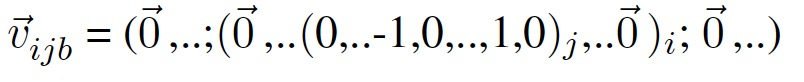
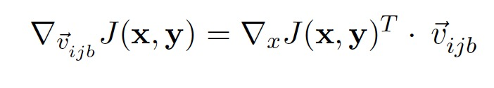
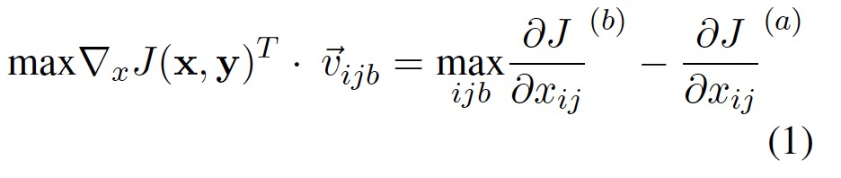
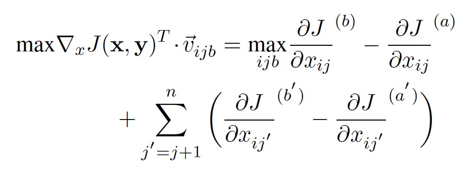
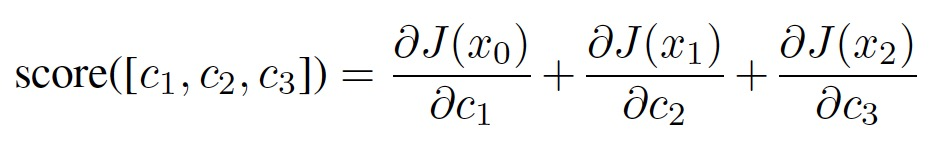
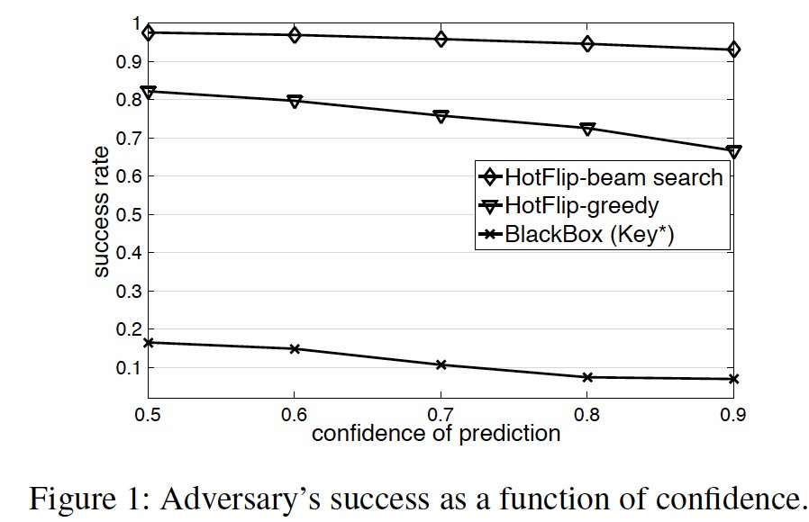
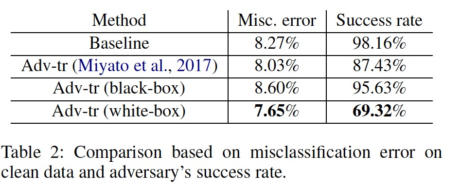
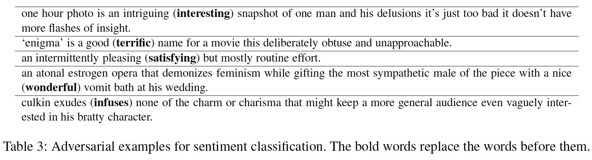

# HotFlip: White-Box Adversarial Examples for Text Classification

此篇文章是美国俄勒冈大学和中国南京大学2018年发表在ACL上的一篇文章。主要为对白盒对抗性样本的研究。

## 摘要

作者提出了一个有效的生成白盒对抗样本的方法来去欺骗字符级的神经分类器。作者发现仅仅需要少量的操作就能大幅度的降低准确性。这种方法主要是基于单热输入向量的梯度实现原子翻转操作即将一个token换成另一个token。由于这种有效的方法，作者可以应用对抗网络来使模型在测试时的攻击更加健壮。并且通过语义保留约束，HotFlip也能够适应单词级别的攻击。

## 介绍

对抗性示例是预测性机器学习模型的输入，其被恶意设计以导致性能不佳。对抗性示例暴露了模型表现不佳的输入空间区域，能够帮助理解和提高模型。通过使用这些示例作为训练数据，对抗性训练学习更强大的模型，甚至可以在非对抗性示例上表现更好。之前的工作致力于在黑盒设置中创建对抗示例的启发性方法，没有任何关于模型参数的准确信息。在白盒设置中，我们使用模型的完整信息发动最恶劣的攻击，从而能揭示更大的漏洞。

作者提出了一个针对可区分文本分类器的白盒对手。作者发现仅仅需要一个小的操作就能明显提高分类错误的错误率。另外，快速生成对抗性示例允许进行可行的对抗性训练，这有助于帮助模型抵御对抗性示例，并且增加清晰数据的准确率。

主要贡献：

- 我们提出了一种有效的基于梯度的优化方法，以便在其单热表示中操纵离散文本结构。
- 我们通过研究其对攻击的弹性及其对清洁测试数据的准确性，研究了使用对抗性示例训练的分类器的稳健性。

## 相关工作

对抗性示例是研究深度学习模型漏洞很有用的工具。对抗性示例在机器学习上有很长的历史，可以追溯到对于线性垃圾邮件分类器的对抗攻击。Hosseini et al. (2017）表明即使是做简单的修改比如在字符之间增加空格和点，就能大幅改变Google’s perspective API 的毒性评分。Belinkov and Bisk (2018)表明字符级机器翻译系统对随机字符操作过于敏感，例如键盘错别字。他们在句子的每一个单词中增加合成的自然的噪声。然而，在我们的实验中，我们关心句子中的失真程度，并寻找能够在有限预算内增加损失的更强大的对手。我们提出了一种有效的方法，而不是随机扰动文本，它可以使用模型相对于输入的梯度生成对抗性文本。对抗训练交错训练，产生对抗性实例[Explaining and harnessing adversarial examples 2015.ICLR](https://arxiv.org/pdf/1412.6572.pdf)具体地说，在每次训练迭代之后，创建对抗性示例并将其添加到小批量中。一种基于梯度的投影方法，被Madry等人（2018）用来创建对抗性示例，已被证明是对抗图像分类的对抗性攻击最有效的防御机制之一。Miyato et al. (2017)通过在单词嵌入中添加噪声来创建对抗性示例，而不创建真实世界的文本对抗示例。我们是第一个提出产生真实世界对抗性示例的方法，能够被用于有效的对抗性训练。

## HotFlip

HotFlip是一种用于生成具有字符替换（“翻转”）的对抗示例的方法。Hot-Flip还通过将它们表示为字符替换序列来支持插入和删除操作。它使用相对于单热输入表示的梯度来有效地估计哪个单独的变化具有最高的估计损失，并且它使用波束搜索来找到一起操作的一组操作以使分类器混淆。

### 定义

使用户J(x,y)表示输入为x，正确输出为y的模型的损失。例如，对于分类器，损失将是softmax单元输出的对数损失。设V为字母，x为长度为L的字符，xij  属于\{0，1\}|V|表示第i个单词的第j个字符的单热矢量。字符序列能被表示为x = [(x11,.. x1n);..(xm1,.. xmn)]

### 操作的导数

我们将文本操作表示为输入空间中的向量，并通过关于这些操作的方向导数估计损失的变化。基于这个导数，对手可以选择损失增加最快的方向。我们的算法只需要一个函数评估（正向传递）和一个梯度计算（反向传递）来估计最佳可能的翻转。

第i个单词的第j个字符的翻转(a → b)可以通过如下向量表示：

其中-1和1分别位于字母表的第a和第b个字符的相应位置，xij(a)=1.可以从沿该向量的方向导数获得损失变化的一阶近似：

我们选择损失增幅最大的向量：

使用导数来作为代理损失，我们只需要通过公式一找到最佳的改变，就能估计(a → b)最佳的字符变换。这与基于损失的简单方法形成对比，后者必须查询分类器以获得每个可能的变化以计算由这些变化引起的精确损失。

在第i个单词第j个位置插入字符也可以被认为是原子翻转。随后是更多翻转，因为字符向右移动直到单词的结尾。

同样的，字符删除也可以被认为是字符翻转。由于方向矢量（操作）的大小不同，我们通过矢量的L2范数归一化，即v/(2N)1/2，其中N是总翻转的数量。

### 多项改变

r步骤的贪婪或波束搜索将给出一个最大r翻转的对抗性示例，或者更具体地说是在距离原始示例的L0距离r内的对抗性示例。我们的波束搜索只需要O（br）前向传递和相同数量的后向传递，其中r是预算，b是波束宽度。举个例子。对于损失函数J(.)，输入时x0各自的改变是cj。我们使用偏J(x0)/偏cj评估变化的得分。对于3个变化[c1，c2，c3]的序列，我们评估“得分”如下。

其中x1和x2分别是应用[c1]和[c1，c2]后的修改输入。我们需要b前向和后向传递来计算路径每一步的导数，导致了O（br）查询。相比之下，基于损耗的方法需要在波束搜索的每个阶段计算每个可能变化的精确损失，从而导致O（brL | V |）查询。

## 实验

原则上讲，单热翻转能够被应用到任何不同的基于字符的分类器上。在这里，作者使用的baseline为CharCNN-LSTM[Yoon Kim Character-aware neural language models. AAAI.](https://arxiv.org/pdf/1508.06615.pdf)

使用的数据集：

+ AG’s news：120,000训练集，7,600测试集。4个类：World, Sports, Business, and Science/Technology

网络模型：

+ 2层堆叠LSTM和500个隐藏单元。字符嵌入大小为25，1000个内核宽度为6。

训练：

+ 采用SGD和梯度裁剪，批量大小为64，使用10%训练数据作为开发集，训练25轮。如果词汇表中不存在新词，我们只允许更改字符，以避免更有可能改变文本含义的更改。对手使用的光束大小为10，并且文档中预算最多为字符的10％。

图1，我们根据错误分类的可接受置信度得分绘制对手的成功率。只有当分类器使用给定的置信度得分错误分类实例时，我们才认为攻击者是成功的。对于此实验，我们为10％的测试集创建了对抗性示例。

作者比较了（贪心）黑盒对手，其中黑盒对手没有利用模型的参数信息，只是使用随机的字符替换在查询分类器。Belinkov and Bisk (2018)定义了攻击-key。即被替换的字符在键盘中相邻位置的字符。但是我们允许一个更强大的黑盒攻击者-key*，即可以用字母表中的任何字母来替换。正如预期的那样，白盒对手的破坏性更大，并且成功率更高。可以看出，即使使用0.9置信度约束，波束搜索策略在欺骗分类器方面也非常有效，能欺骗对于超过90％的实例分类器。贪婪的搜索效果较差，特别是在产生高可信度的分数时。

+ 我们在文档中使用最多10％的字符作为对手的预算，但是我们的对手平均改变了4.18％的字符以在置信度0.5下欺骗分类器。对手在80％的时间内选择翻转操作，并且有利于将插入删除为2比1。

### 稳健性

对我们的对抗性训练，我们只使用了翻转操作，也仅仅使用模型的稳健性来评估这个操作。这是因为插入和删除操作的生成速度要慢n倍，其中n是单词允许的最大字符数。因为在我们的实验中，对于置信度得分没有约束。我们为每个训练样本翻转r个字符，根据开发集的准确性，调整后将其设置为文本中字符的20％。此外，为了更快地生成对抗性示例，我们在第一次向后传递后同时直接应用顶部r翻转。

我们使用完整的测试集进行此实验，我们将HotFlip对抗性训练与白盒（监督）对抗训练[Adversarial training methods for semisupervised text classification 2017](https://arxiv.org/pdf/1605.07725.pdf)进行比较，该训练扰乱了词嵌入，而我们扰乱字符嵌入。具体地说，每个字符的对抗性噪声受到由字中字符序列组成的嵌入矩阵的Frobenius范数所约束。作者还创建了另一个用来代替代替白盒对抗示例的baseline，作者在最小的批量中增加了黑盒对抗示例key*。如表2所示，作者的方法降低了错误分类的错误率，大大降低了对手的成功率。尤其是在通过HotFlip产生的真实对抗示例的对抗训练比在通过向嵌入添加噪声而创建的伪对抗示例的训练更有效。

我们对抗训练模型的当前误差仍然超出可接受的速率；主要是因为我们在测试时的对手使用光束搜索（beam search），它比我们模型的内部对手强。在计算机视觉中已经观察到这一点，其中最强大的对手不足以进行对抗性训练，但可以打破较弱对手训练的模型

### 人类的感知

我们人评估这个实验，那么我们基于字符的对抗示例很少改变句子的意思。我们进行了一项实验，注释了由亚马逊机械土耳其人中至少有三名人群工人注释的600个随机挑选的实例。该集包含AG-news数据集每类的150个示例，所有这些都由分类器正确分类。我们通过算法操纵这个集合的一半，这可以成功地欺骗分类器对这300个对抗性示例进行错误分类。我们的参与者的中位数准确度从清洁示例的87.49％降低到对抗示例的85.71％，降低了1.78％。人类表现的类似小幅下降已经被用于图像分类（Papernot等，2016）和文本理解（Jia和Liang，2017）

## 单词级的HotFlip

通过计算关于单热词向量的导数，HotFlip可以自然地适用于为词级模型生成对抗性示例。在一些字符改变之后，文本的意义很可能被读者保留或推断（Rawlinson，1976），这也得到了我们人类受试者研究的证实。相比之下，单词级别的对抗操作更有可能改变文本的含义，这使得必须使用保留语义的约束。例如，在‘’this was a good movie‘’这句话中，将''good''改变成''bad''就改变了句子的情感。事实上，我们期望模型在这些改变之后能预测一个不同的标签。

为了展示HotFlip对单词级分类器的适用性，我们使用Kim的CNN（2014）训练用于SST数据集的二元情感分类。 为了创建对抗性示例，我们添加约束，以便生成的句子可能保留原始含义; 只有满足这些约束条件时，我们才会将单词wi翻转为wj：

1. 嵌入单词之间的余弦相似度大于阈值（0.8）
2. 这两个词具有相同的词性
3. 我们不允许替换停用词，就像许多停用词一样，很难找到替换它们仍然会使句子在语法上正确的情况。 为了同样的目的，我们也不允许用相同的词汇将单词改为另一个单词。

表3展示了仅仅只有一个单词翻转的一些对抗性示例。在第二个和第四个对手示例中，对手在整体非常负面的评论中将一个积极的词（即good, nice）翻转成了一个高度积极的词（即，terrific, wonderful）。这些例子虽然有趣且直观，但并不丰富，因此对NLP字级模型的威胁较小。具体来说，鉴于严格的约束条件，我们只能创建41个带有一个或两个翻转的示例。 （2％正确分类的SST测试集实例）。

为了对字符级模型的相对脆性进行定性分析，我们研究了单词嵌入的变化如对抗性翻转，插入或删除操作如表4所示：

我们使用最高层的输出作为单词表示，并展示了几个对抗单词的嵌入，但是原始单词却不在其最前面的5个最近邻居中。

在字符级模型中，从词汇表中选择单词的查找操作被字符序列特征提取器替换，该提取器为任何输入提供嵌入，包括将映射到字级模型中的UNK令牌的OOV字。 这使得在字符级表示中引入的嵌入空间更加密集，这使得字符级模型在小的对抗性扰动下更可能出错。

## 总结和未来工作

白盒攻击是攻击者可以对机器学习模型造成的最严重的攻击形式。我们通过计算关于少数字符编辑操作（即，翻转，插入，删除）的导数来创建白盒对抗性示例，其可以用于波束搜索（beam-search）优化。虽然字符编辑操作对人类的理解影响不大，但我们发现字符级模型对对抗性扰动非常敏感。在对抗训练中使用这些对抗性示例使得模型对这种攻击更加健壮，并且对于看不见的干净数据更加健壮。对比和评估不同字符级模型对不同任务的鲁棒性是对抗性NLP的重要未来方向。此外，文本的离散性使得理解对抗性例子的景观变得更具挑战性。这方面的研究可以揭示NLP模型的脆弱性。

