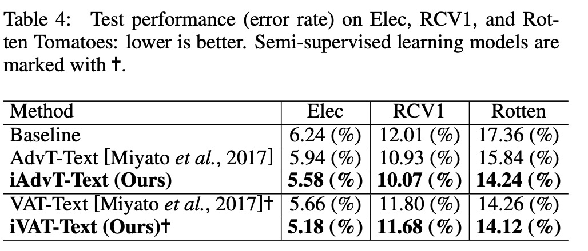

# 文本输入嵌入空间中可解释的对抗扰动

此文由Motoki Sato发表于2018IJCAI

[原文链接](http://export.arxiv.org/pdf/1805.02917) [github地址](https://github.com/aonotas/interpretable_adv)

## 摘要

一种有希望的方法直接将在图像处理领域中开发的对抗训练应用于输入词嵌入空间而不是文本的离散输入空间。然而，这种方法放弃了这种可解释性，如为什么生成对抗性文本以显着提高NLP任务的性能。本文通过限制输入嵌入空间中现有单词的扰动方向，恢复了对这些方法的可解释性。因此，我们可以在保持甚至提高任务性能的同时，将扰动看作是句子中单词的替换，从而将每个带有扰动的输入直接重构为实际文本。

## 介绍

[Intriguing properties of neural networks. In ICLR, 2014.]首先发现并讨论了（小）扰动的存在，这种扰动会导致机器学习模型中的预测误差。他们称其为扰动输入的对抗性示例。通过优化输入以最大程度地提高预测误差，可以轻松找到此类干扰。在发现之后，提出了一种称为对抗训练（AdvT）的框架[Explaining and harnessing adversarial examples. In ICLR, 2015.]()，其基本思想是训练可以正确分类原始训练数据和基于训练数据生成的对抗示例的模型。使用AdvT，我们可以进一步提高模型的泛化性能。这种改进意味着在模型训练期间，对抗性示例的损失函数可以作为良好的正则化器。当前，用于生成对抗性示例的技术对于神经图像处理至关重要，既可以改善任务性能，又可以分析黑盒神经模型的行为。

与它在图像处理领域的巨大成功不同，AdvT不能直接应用于自然语言处理（NLP）领域的任务。 这是因为我们无法计算NLP字段中任务的扰动输入，因为输入包含离散的符号，这些符号不是图像处理中使用的连续空间。最近，有人提出了一种新颖的策略来改进NLP任务的AdvT [Adversarial training methods for semisupervised text classification. In ICLR, 2017.]()，其关键策略简单明了：将AdvT应用于连续单词嵌入空间而不是文本的离散输入空间。他们的方法保留了在图像处理领域发展的理论背景，并且可以很好地用作正则化器。实际上，该方法显着提高了任务性能，并在多个文本分类任务上实现了最新的性能。这种方法的另一个显着优点是简洁的体系结构。它仅需要损失函数的梯度即可获得对抗性扰动（参见等式9）。注意，梯度计算是在训练期间用于更新模型参数的标准计算过程。 我们可以以惊人的小计算成本在嵌入空间中获得对抗性扰动，而无需合并任何其他复杂的体系结构。

相反，该方法的主要缺点是，它放弃了人们可以解释的对抗性示例的生成，因为如何在输入词嵌入空间中将扰动的输入适当地重构为实际文本并不容易。这意味着该方法缺乏可解释性。 事实上，他们宣称由于他们的培训策略不再旨在对抗对手，他们专门提出将其作为稳定模型的正则化方法[Adversarial training methods for semisupervised text classification. In ICLR, 2017.]()。研究人员和开发人员通常需要生成对抗示例（对抗文本）以了解黑盒神经模型的行为。因此，在格式完善的低成本方法（基于梯度）与NLP领域中使用的AdvT方法的可解释性之间存在折衷。

本文的主题是减少这种权衡差距。 本文在保留正则化程序的良好功能的同时恢复了可解释性。我们的主要思想是仅将扰动的方向限制为单词嵌入空间中现有单词的位置。图1说明了我们的想法的直观解释。 通过我们的方法，我们可以通过将扰动视为句子中单词的替代词，将带有扰动的每个输入直接解释为实际句子。 据我们所知，我们的研究是第一个讨论AdvT的可解释性的试验，该解释基于对NLP领域中任务的对抗性扰动。

## 相关工作

多项研究已将AdvT的思想应用于某些NLP任务。提出了一种通过众包在段落末尾添加句子来欺骗阅读理解系统的方法。随机字符交换可能会破坏神经机器翻译系统的输出。因此，他们提出了AdvT方法，该方法可生成随机字符交换，并将生成的输入语句用作其模型的附加训练数据。而且，一种方法通过将单词替换为其同义词来生成大量输入句子。

在自然语言处理领域中生成对抗性示例的主要策略与在图像处理领域中开发的策略明显不同，后者是临时性的，例如，使用人类知识[Jia and Liang，2017]，词典[Samanta and Mehta，2017] ，或要求进行详尽搜索之类的昂贵程序[Samanta and Mehta，2017]。这些方法本质上并不是基于先前讨论的摄动思想，该思想最初是为生成对抗性示例而首先讨论的[Szegedy等人，2014]。

相比之下，我们的基线方法[Adversarial training methods for semisupervised text classification. In ICLR, 2017.]()保留了图像处理领域发展的理论背景。 因此，请注意，本文中讨论的方法与上述NLP领域中采用的当前原始策略有不同的策略。

## 目标任务和基准模型

本节简要说明了目标任务的正式定义，文本分类和序列标签，以及为这些任务建模的基线神经模型。 图2显示了基线神经模型的体系结构。

### 常用符号

### 文本分类的基准模型

我们使用基于递归神经网络（RNN）的模型对输入X〜进行编码，该模型由LSTM单元组成，然后我们对给定输入X〜的输出Y〜的（条件）概率建模如下：

### 序列标记的基线模型

我们采用双向LSTM编码输入X〜。

### 训练

为了训练文本分类和序列标签，我们通常会找到基于RNN的模型的最佳参数，该参数可以最大程度地减少以下优化问题：

## 嵌入空间中的对抗训练

对抗训练（AdvT）[Explaining and harnessing adversarial examples. In ICLR, 2015.]()是一种新颖的正则化方法，可提高对小扰动输入误类的鲁棒性。为了区分图像处理中的AdvT方法，本文专门将AdvT称为AdvT-Text，该AdvT应用于NLP任务的输入单词嵌入空间，最早在[Adversarial training methods for semisupervised text classification. In ICLR, 2017.]()中提出来的。

## 可解释的对抗扰动

如上所述，我们扩展了Adv-Text，以恢复生成可被人们解释的对抗性文本的能力，同时保持任务的性能。 我们仅将嵌入空间中的扰动方向限制为输入单词嵌入空间中的现有单词。

我们方法背后的直觉是，可以将指向其他单词的方向解释为句子中另一个单词的替换，这可以重建对抗性文本。 我们将AdvT-Text扩展称为可解释的AdvT-Text或iAdvT-Text。

### 可解释的AdvT文本的定义

### 实际计算

### 扩展到半监督学习

[Distributional smoothing with virtual adversarial training. In ICLR, 2016.]()

[Adversarial training methods for semisupervised text classification. In ICLR, 2017.]()

见原文

## 实验

我们在情感分类（SEC）任务，主题分类（CAC）任务和语法错误检测（GED）任务上进行了实验，以评估我们的iAdvT-Text和iVAT-Text方法的有效性。 SEC是一种文本分类任务，可将给定文本分类为肯定或否定类别。 GED是序列标记任务，用于识别非语法单词。

### 数据集

SEC：

IMDB [Andrew L. Maas, Raymond E. Daly, Peter T. Pham, Dan Huang, Andrew Y. Ng, and Christopher Potts. Learning word vectors for sentiment analysis. In ACL, 2011.]()

Elec [Rie Johnson and Tong Zhang.Semi-supervised convolutional neural networks for text categorization via region embedding. In NIPS, volume 28,pages 919–927, 2015.]()

Rotten Tomatoes[Bo Pang and Lillian Lee. Seeing stars:Exploiting class relationships for sentiment categorization with respect to rating scales. In ACL, 2005.]()

CAC:

DBpedia[Jens Lehmann, Robert Isele, Max Jakob, Anja Jentzsch, Dimitris Kontokostas, Pablo N.
Mendes, Sebastian Hellmann, Mohamed Morsey, Patrick van Kleef, Soren Auer, and Christian Bizer. Dbpedia - ¨ a large-scale, multilingual knowledge base extracted from wikipedia. Semantic Web, 6:167–195, 2015.]()

RCV1[David D. Lewis, Yiming Yang, Tony G.Rose, and Fan Li. Rcv1: A new benchmark collection for text categorization research. Journal of Machine Learning Research, 5:361–397, 2004.]()

数据集设置同[Adversarial training methods for semisupervised text classification. In ICLR, 2017.]()

GED:

FCE-public[Helen Yannakoudakis, Ted Briscoe, and Ben Medlock. A new dataset and method for automatically grading esol texts. In ACL, pages 180–189.ACL, 2011.]()

### 模型设置

SEC参考[Adversarial training methods for semisupervised text classification. In ICLR, 2017.]()

此外，根据[Adversarial training methods for semisupervised text classification. In ICLR, 2017.]()，我们使用基于RNN的预训练语言模型（根据可用的标记训练和未标记数据进行训练）来初始化单词嵌入和LSTM权重。[A neural probabilistic language model.](https://blog.csdn.net/xiaqian0917/article/details/51946582)为了减少softmax损失的计算成本，我们使用自适应Softmax [Efficient softmax approximation for gpus. In ICML, 2017.](https://arxiv.org/pdf/1609.04309.pdf)训练语言模型。基于开发集上测得的性能，我们利用了早期停止标准[Overfitting in neural nets: Backpropagation,conjugate gradient, and early stopping. In NIPS, 2000.]()表2汇总了超参数，其中dropout[Dropout: a simple way to prevent neural networks from overfitting. Journal of Machine Learning Research, 15:1929–1958, 2014.]()和Adam [A method for stochastic optimization. CoRR,
abs/1412.6980, 2014.]()。此外，我们实现了我们的方法（iAdvT-Text和iVAT-Text），并使用Chainer [Tokui et al。，2015]并在GPU支持下重新实现了之前的方法（AdvTText和VAT-Text）。 在我们的实现中，所有四种方法都共享子模块，例如基于RNN的模型。 因此，我们的内部实验在相同条件下进行了比较。

详细设置见原文。

### 按照任务性能评估

表3显示了通过错误率评估的IMDB性能。

在评估我们的方法iAdvT-Text和iVAT-Text之前，我们假设它们会分别降低AdvT-Text和VAT-Text的性能，因为我们的方法强烈限制了扰动方向的自由度，以提高可解释性。 这表明单词嵌入空间中实际单词的存在方向为提高泛化性能提供了有用的信息。 两种简单方法（iAdvT-Rand和iAdvT-Best）的性能很差。 表4和表5显示了其他数据集的性能5

### 句子级扰动的可视化

我们将图4中的方法（iAdvT-Text）计算出的扰动可视化

无论模型是否正确学习了研究人员感兴趣的某些现象，都为研究人员提供了解释黑盒神经模型的机会。我们认为，这种可解释性至关重要，尤其是对于复杂的神经模型。 这种可视化的实用性是我们提出的方法的主要主张。

### 对抗文本

我们从iAdvT-Text提供的输入词嵌入空间中的对抗性扰动中重构了对抗性示例，对训练有误的模型进行了错误分类。 为了获得对抗性文本，我们首先确定了最大的扰动，然后将原始单词替换为与最大扰动匹配的单词。如图7所示：

注意，以前的方法AdvT-Text和VAT-Text几乎无法重建这种有效的对抗性文本。 因此，与以前的方法相比，这是我们方法的明显优势。

## 总结

本文讨论了基于对抗性扰动的对抗性训练的可解释性，该对抗性扰动被应用于自然语言处理领域的任务。 我们的建议将扰动的方向限制在单词嵌入空间中现有单词的位置。 我们证明了我们的方法可以成功地生成合理的对抗文本并在输入嵌入空间中产生扰动的可视化解释，我们相信这将极大地帮助研究人员分析模型的行为。 此外，我们确认我们的方法iAdvT-Text和iVAT Text在经过深入研究的情感分类（SEC）类别分类（CAC）和语法错误检测（GED）基准数据集中保持或改善了通过基线方法AdvT-Text和VAT-Text获得的最新性能。