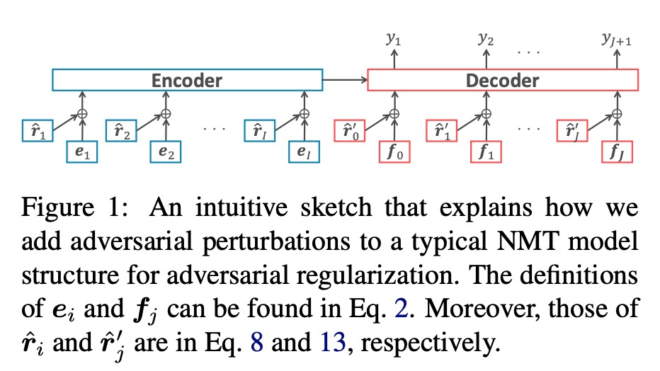

# Effective Adversarial Regularization for Neural Machine Translation

此篇由东北大学作者Motoki Sato发表于2019年ACL会议论文

[原文链接](https://www.aclweb.org/anthology/P19-1020)

## 摘要

基于对抗扰动的正则化技术，最初从图像领域发展而来，并且成功的应用于文本分类领域。作者想要将它应用在神经机器翻译NMT领域。但是，将此方法应用于此类模型并非易事。 因此，本文研究了应用对抗扰动的几种可能配置的有效性，并揭示了对抗正则化技术可以显着且持续地改善广泛使用的NMT模型的性能，例如基于LSTM和基于Transformer的模型。

## 介绍

在机器学习模型中存在引起临界预测误差的（小）扰动首先在图像处理领域被发现和讨论。这种扰动的输入通常被称为文献中的对抗性示例。随后，[Explaining and Harnessing Adversarial Examples.Goodfellow et al. 2015.ICLR](https://arxiv.org/abs/1412.6572)提出了一个学习框架，该框架同时利用对抗性示例作为额外的训练数据来减少预测误差。 这种学习框架被称为对抗性训练（adversarial training）。

在NLP领域，输入的是一系列的离散符号，例如单词和句子。由于向符号添加小扰动是不合理的，因此将对抗训练的概念应用于NLP任务已被认为是一个具有挑战性的问题。但是[Adversarial Training Methods for SemiSupervised Text Classification.Takeru Miyato et al.2017.ICLR]()克服了这些问题，报告了在文本分类任务的多个基准数据集上的出色性能改进。他们成功的关键思想是将对抗性扰动应用于输入嵌入层而不是像图像处理任务中使用的输入本身。他们研究的一个重要意义是他们的方法可以被解释为正则化方法，因此，他们不专注于生成对抗性的例子。 我们将这种正则化技术称为对抗正则化（adversarial regularization）。

我们的目标是进一步将这种有前途的方法用于更复杂和关键的神经模型，即神经机器翻译（NMT）模型，因为NMT模型最近在NLP研究社区中扮演着核心角色之一;NMT模型不仅被广泛用于NMT，还被广泛用于许多其他NLP任务，例如文本摘要，语法错误纠正，对话生成和解析。不幸的是，这个应用程序并不是完全无关紧要的，因为我们可能有几种配置将对抗扰动应用到NMT模型中（详见第5节）。 图1说明了具有对抗扰动的NMT模型的模型体系结构。

因此，本文的目的是揭示对抗正则化在NMT模型中的有效性，并鼓励研究人员/开发人员将对抗正则化作为进一步提高其NMT模型性能的常用技术。我们研究了几种可能的配置的有效性，这些配置可以显着且持续地改善典型基线NMT模型的性能，例如基于LSTM和基于Transformer的模型。

## 相关工作

最近有几项研究将对抗性训练应用于NLP任务。例如：[Interpretable Adversarial Perturbation in Input Embedding Space for Text.Motoki.2018(IJCAI)](http://export.arxiv.org/pdf/1805.02917)这些方法的主要焦点是在训练阶段结合对抗性实例，这与我们的注意力，对抗正则化是正交的，如第1节所述。

[Semi-Supervised Sequence Modeling with Cross-View Training.Clark.2018.(EMNLP)](https://arxiv.org/pdf/1809.08370.pdf)使用虚拟对抗训练（VAT），这是Miyato等人(2016)最初提出的对抗正则化技术的半监督扩展。在他们的实验中将结果与他们提出的方法的结果进行比较。 因此，神经模型的焦点与本文不同。 即，他们专注于顺序标记，而我们讨论NMT模型。与我们的工作并行，[Improving Neural Language Modeling via Adversarial Training.Dilin Wang.2019.ICML](https://arxiv.org/pdf/1906.03805.pdf)还研究了对抗正则化技术在神经语言建模和NMT中的有效性。 他们还展示了对抗正则化技术对NMT模型的影响。 我们研究了他们的论文中尚未研究的几种实际配置的有效性，例如与VAT和反向翻译的组合。

## 神经机器翻译模型

## 对抗正则化

简要说明[Adversarial Training Methods for SemiSupervised Text Classification.Takeru Miyato et al.2017.ICLR]()应用在文本分类上的对抗正则化技术及[Distributional
Smoothing with Virtual Adversarial Training.Takeru Miyato et al.2016.ICLR]()的虚拟对抗训练

## NMT上的对抗正则化

## 实验

虚拟对抗训练要好于对抗训练。正如[Adversarial Machine Learning at Scale.Alexey Kurakin, Ian J Goodfellow2017.ICLR](https://arxiv.org/pdf/1611.01236.pdf)所讨论的那样，对抗训练(AdvT)从正确的例子中产生了对抗性的例子，因此，由AdvT训练的模型倾向于过度拟合训练数据。 他们将这种AdvT现象称为标签泄漏( label leaking)。