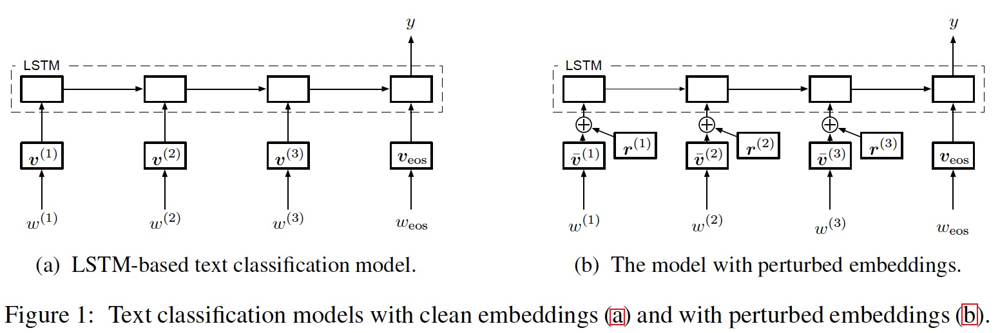
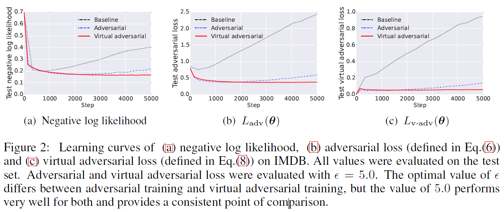
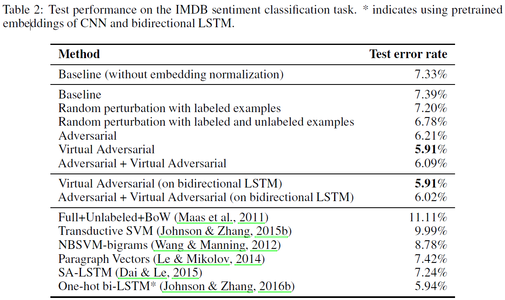
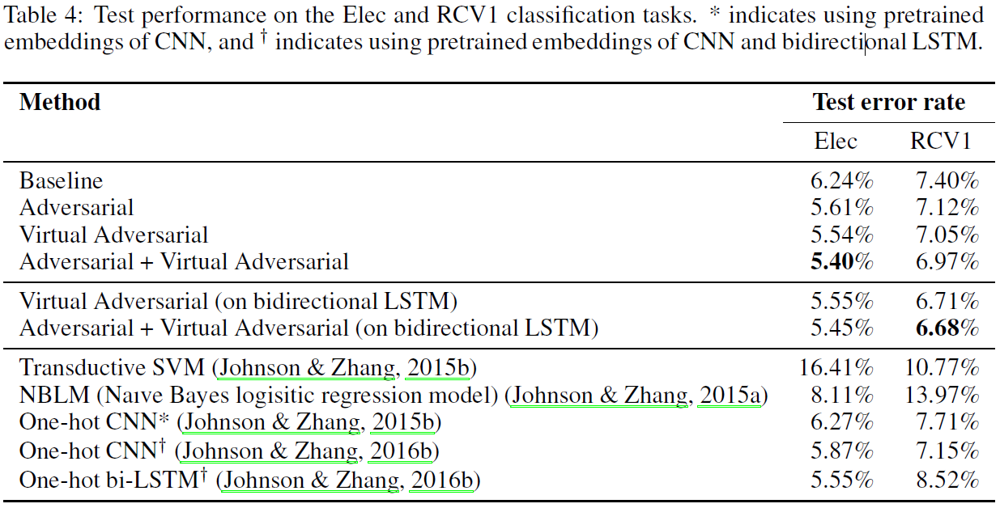
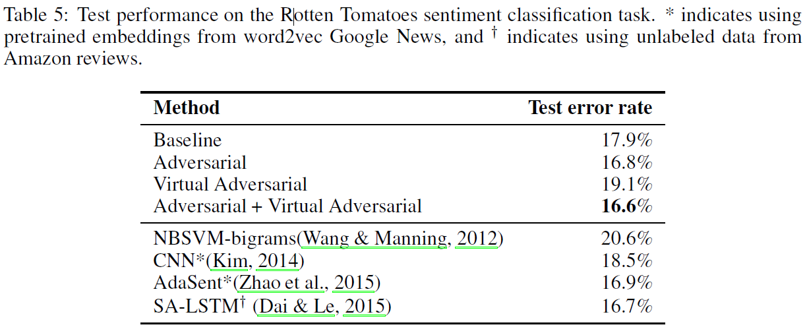
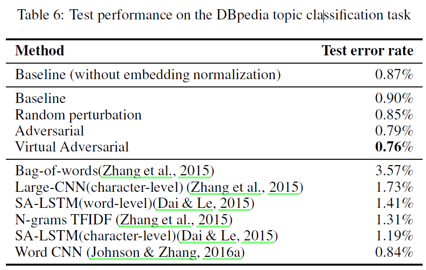

# 半监督文本分类的对抗训练方法
此篇论文由京都大学ATR认知机制实验室，Google Brain，OpenAI共同发表于2017年的ICLR会议上
[原文链接](https://arxiv.org/abs/1605.07725)

## 摘要
通过在循环神经网络的词嵌入上添加扰动，将对抗训练和虚拟对抗训练应用到文本领域。不仅在半监督学习和有监督学习任务上取得了先进的结果，而且模型不容易过拟合
## 1介绍
对抗性示例是通过对输入进行小扰动而创建的示例，旨在显着增加机器学习模型所带来的损失；对抗性训练是训练模型以正确分类未修改的示例和对抗性示例的过程。对抗训练不仅提高了对抗性示例的鲁棒性，还提高了原始示例的泛化性能。
对抗训练要求在训练使用监督成本的模型的时候使用标记信息，因为标记是在成本函数中的，而对抗扰动的目标就是最大化成本函数。
虚拟对抗训练将以上想法扩展到了半监督领域和非标记实例。这是通过对模型正则化来完成的。虚拟对抗训练实现了在有监督和半监督学习任务的更好的泛化能力。
对抗性扰动通常包括对很多实值输入进行小的修改。但是对于文本分类，输入是离散的，通常是一系列的高维单热向量。因为一组高维单热向量不允许无穷小扰动，所以将扰动定义到连续的词嵌入上。传统的对抗性和虚拟对抗性训练既可以被解释为正则化策略，也可以被解释为对于恶意输入攻击者的防御。由于扰动嵌入不会映射到任何单词，并且攻击者可能无法访问单词嵌入层，因此我们提出的训练策略不再用于防御对手。因此，我们提出这种方法仅作为通过稳定分类函数来正则化文本分类器的手段。我们强调，仅优化一个额外的超参数ǫ，即限制对抗扰动大小的范数约束，实现了这种最先进的性能。

## 2模型
给定文本序列T的单词定义为{w(t)|t=1,…,T}，其相应的目标是y.
词嵌入矩阵VR(K+1)×D，其中表示词表中单词的数量，每一行vk表示第i个单词相应的词嵌入。第k+1个词嵌入表示序列的结束，用veos表示。我们主要使用简单的基于LSTM的神经网络模型，如图1所示：在时间步t，输入的是离散单词w(t)和相应的词嵌入v(t)。
在词模型的基础上，作者又构建了对于文本分类的双向LSTM模型，即在反向序列上添加额外的LSTM到图1中描述的单向LSTM模型上。然后，模型预测序列两端的级联LSTM输出上的标签

在对抗训练和虚拟对抗训练中，作者增加了嵌入的扰动来使分类器更具有鲁棒性，如图1b所示。该模型可以通过学习具有非常大规范的嵌入来使扰动无关紧要，但是这不是一个好的解决方法。所以作者用标准化嵌入¯vk代替vk，定义（1）所示

其中fi是第i个单词在所有训练实例的频率

## 3对抗训练和虚拟对抗训练
对抗训练是一个新颖的分类器正则化方法，可以提高分类器对于小的，近似最坏情况扰动的鲁棒性。
x表示输入，θ表示分类器的参数。当应用于分类器的时候，对抗训练会将以下内容添加到成本函数中：

其中r是输入上的扰动，ˆθ是分类器参数的常数集。在这里之所以使用ˆθ而不是θ是因为反向传播算法不能在对抗实例构造过程中传播梯度。在训练的每一个步骤中，我们识别对当前模型p(y|x; ˆθ)（2）的最坏情况下的扰动，并且通过最小化（2）训练模型对这种扰动的鲁棒性。但是我们无法准确计算这个值，因为关于r的精确最小化对于诸如神经网络的许多模型都是难以处理的。为了解决这个问题，作者提出通过在x周围线性化logp(y|x; ˆθ)来近似该值。利用方程（2）中的线性近似和L2范数约束，得到的对抗扰动为：

这个扰动可以很容易的利用神经网络的反向传播计算
虚拟对抗训练是一个和对抗训练很接近的正则化方法。虚拟对抗网络引入的成本如下：

其中KL表示p和q的KL差异。通过最小化公式(3)分类器能够被训练的很平滑，这可以被认为是使分类器抵抗对当前模型最敏感的方向上的扰动。虚拟对抗网络的损失（公式3）只需要输入x，而不需要实际的标签y。但是我们也不能计算虚拟对抗训练的损失，因此文章中利用反向传播来有效的计算公式3
正如前文提到，作者将对抗扰动定义于词嵌入上而不是输入上，所以作者将一系列词嵌入向量[v(1),v(2)…v(T)]表示为s,对于给定的s，y的条件概率为p(y|s; θ)，其中θ是模型参数。所以在s上定义对抗扰动radv如下

为了对方程（5）中定义的对抗扰动具有鲁棒性，我们通过以下方法定义对抗性损失：

其中N是标记实例的数量。在我们的实验中，对抗训练是指通过随机梯度下降最小化加上Ladv的负对数似然。
在我们的文本分类模型的虚拟对抗训练里，在每步训练中，我们计算下面的近似虚拟对抗扰动：

其中d是TD维小随机向量。
该近似对应于二阶泰勒展开和方程（3）中的幂方法的单次迭代。对抗训练损失如下：

N’是有标注和无标注实例的总数量。
有关于对抗方法的最新综述请移步：Adversarial perturbations of deep neural networks.

## 4实验设置
所有的实验都是在GPU上使用TensorFlow
[github源代码链接](https://github.com/tensorflow/models/tree/master/research/adversarial_text)
实验数据集如表1所示：

### 4.1循环语言模型预训练
基于baseline: [Semi-supervised sequence learning](https://arxiv.org/abs/1511.01432)
利用词嵌入矩阵和LSTM权重在有标注和无标注实例上预训练循环神经网络模型。
对于单层的单向LSTM：
1024个隐层单元；在IMDB数据集上的词嵌入维度为256，其他数据集上是512；使用带有1024个候选样本的采样softmax损失进行训练；
Adam优化：批量大小（batch size）256，初始学习率0.001；每个训练步骤的学习率为0.9999的指数衰减因子。
训练100,000步；在除了词嵌入之外的所有参数上应用了将范数设置为1.0的渐变剪辑；
为了减少GPU上的运行时间，我们使用截断的反向传播，从序列的每一端开始最多400个词；对于循环语言模型的正则化，我们对单词嵌入层应用了丢弃率（dropout），具有0.5丢弃率
对于双向LSTM模型：
对于正向序列和反向序列应用512个隐藏单元；使用256维词嵌入，超参数和单向LSTM相同；只在IMDB, Elec and RCV上训练。
使用循环语言模型进行预训练对我们测试的所有数据集的分类性能非常有效，因此我们在第5节中的结果与此预训练有关。

### 4.2训练分类模型
预训练之后，我们采用第三节的对抗训练和虚拟对抗训练一个文本分类模型如上图1a所示。在得到目标y的softmax层和最终的LSTM输出层之间增加隐藏层。其中IMDB, Elec and Rotten Tomatoes数据集是30维的隐藏层，DBpedia and RCV1是128维。隐藏层的注意力函数是ReLU。对于优化方法，依然采用Adam优化器：0.0005的初始学习率，0.9998指数衰减，在IMDB, Elec, RCV1上的批量大小是64，DBpedia是128.。对于Rotten Tomatoes数据集，对于每个步骤，我们采用一批64的大小来计算负对数似然和对抗性训练的损失，512用于计算虚拟对抗训练的损失，而且我们使用未标记的数据集中使用长度T小于25的文本。除了IMDB and DBpedia数据集，我们迭代了10000次训练。IMDB用了15000次，DBpedia用了20000次。我们再次将除了单词嵌入之外的所有参数的标准剪切为1.0。我们还使用截断的反向传播多达400个单词，并且还从序列的每一端产生多达400个单词的对抗性和虚拟对抗性扰动。
但是我们双向LSTM收敛的很慢，所以我们迭代了15000次。

## 5结果
### 5.1IMDB数据集的测试性能和模型分析
图2显示了在IMDB数据集上的基准方法，对抗训练，虚拟对抗训练的学习曲线，通过2a可以发现对抗训练和虚拟对抗训练相对于基准方法实现了负对数似然（损失函数），而且随着其他的方法在训练集上出现过拟合情况，虚拟对抗训练凭借利用的无标注实例，还能保持较低的负对数似然。通过图2b和2c可以发现对于对抗训练和虚拟对抗训练的损失在f负对数似然有相同的趋势，而且虚拟对抗训练相比于其他的方法能保持他的值更低。

表2显示了在IMDB上的每个训练方法的测试性能。Adversarial + Virtual Adversarial指的是对抗损失和虚拟对抗损失使用共享的范数约束。
对于只有嵌入丢失，模型实现7.39%的错误率
对抗训练和虚拟对抗训练改善了baselie，其中虚拟对抗训练取得的成绩与现有技术水平相当，误差率为5.91％，尽管现有技术模型需要训练双向LSTM，而我们的模型仅使用单向LSTM。
我们也展现了双向的LSTM结果。我们的双向LSTM模型与具有虚拟对抗训练的单向LSTM具有相同的性能。
一个通常的误解是对抗训练就是相当于对嘈杂的例子进行训练。噪声实际上是比对抗性扰动弱得多的正则化因素，因为在高维输入空间，一个平均噪音向量近似与成本梯度正交。明确选择对抗性扰动以不断增加成本，为了证明对抗训练优于增加噪音，文章中添加了对照实验，它在序列中的每个嵌入中用来自具有缩放范数的多元高斯的随机扰动代替对抗性扰动。
在表2中，Random perturbation with labeled examples指的是使用随机扰动代替radv Randomperturbationwith labeled and unlabeled examples指的是使用随机扰动代替rv-adv.
结果表明，每一个对抗训练方法性能都优于随机扰动方法。

为了验证对抗训练和虚拟对抗训练在嵌入的效果，作者查看了使用每种方法训练的嵌入。表3展示了10个与’good’和’bad’最近邻的训练嵌入。由于语言模型预训练步骤，基线和随机方法都受到语言语法结构的强烈影响，但不受文本分类任务语义的强烈影响。比如’bad’在基线和随机扰动方法上是’good’的近邻。因为’bad’和’good’都是形容词，他们都可以修饰同样的名词集，所以对于语言模型给他们两个分配相似的嵌入是合情合理的，但是他们不能传达更多关于单词实际意思的信息。但是对抗训练要确保一个句子的意思不能通过小的改变而颠倒，所以这些具有相似语义但是不同意思的单词就会被分离。

### 5.2 Elec and RCV1和Rotten Tomatoes 数据集上的测试性能
表4展示了在Elec and RCV1数据集上的测试性能。可以发现我们提出的方法实现了最好的性能，即使是对于结合了CNN和双向LSTM的模型。对于为什么双向的LSTM模型能在RCV1上是实现更好的性能是因为该数据集是一些非常长的句子，而双向模型额能更好的通过逆序句处理长句子的短依赖问题。

表5展示了在Rotten Tomatoes数据集上的测试性能。实验结果表明对抗训练能够对基线方法提高性能。对抗训练和虚拟对抗训练结合能够实现最先进的性能。但是仅仅使用虚拟对抗训练的测试性能不如基线好，作者分析可能是因为Rotten Tomatoes数据集的标注句子太少而且太短造成的。在这种情况下，未标记示例上的虚拟对抗性损失超过了监督损失，因此模型优先考虑对扰动具有鲁棒性而不是获得正确答案。

### 5.3对于DBpedia数据集的纯监督分类任务的性能
表6展示了在DBpedia数据集上的每一种方法的测试性能。其中Random perturbation是和5.1节‘Random perturbation with labeled examples相同的方法。

## 6相关工作
Dropout是一种广泛用于包括文本在内的许多领域的正则化方法。之前也有很多工作通过在训练过程的输入和隐藏层增加噪音来防止过拟合。然而在我们的实验和之前的工作中（Distributional smoothing with virtual adversarial training.）表明使用具有对抗和虚拟对抗扰动的训练优于具有随机扰动的方法。
对于神经网络的半监督学习，特别是在图像领域，一个常用的方法就是训练一个生成模型，其潜在特征可以用作分类的特征。这些方法在图像领域已经实现了最先进的性能。然而，这些方法需要许多额外的超参数与生成模型，并且生成模型对于将提供良好的监督学习性能的条件知之甚少。相比之下，对抗训练和虚拟对抗训练仅仅要求一个超参数，而且具有直观的可解释性和稳定性优化。
目前还有一些半监督方法应用CNN和RNN的文本分类中，这些方法利用“视图嵌入”，其使用围绕单词的窗口来生成其嵌入。当这些被用作分类模型的预训练模型时，发现它们可以改善泛化性能。这些方法和我们的方法是互补的，因为我们是从循环预训练语言模型的改进。
## 7总结
在本文的实验中，作者发现对抗训练和虚拟对抗训练在文本分类任务的序列模型中有很好的正则化表现，而且他们不仅能够提高分类的性能，也能提高词嵌入的质量。