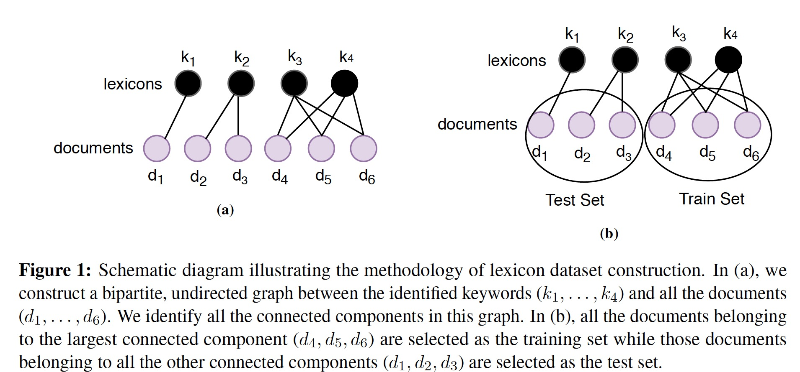
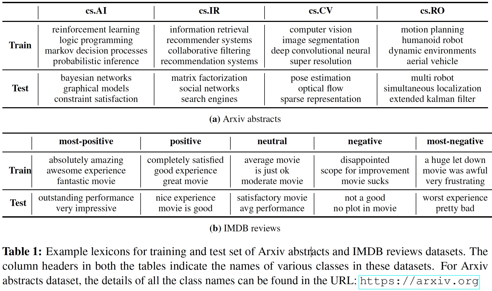
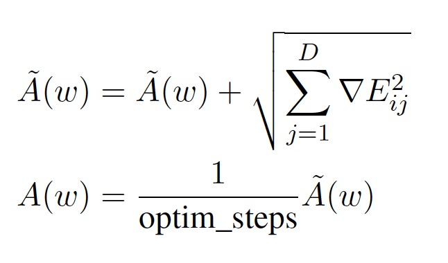
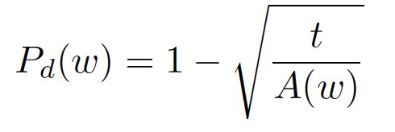
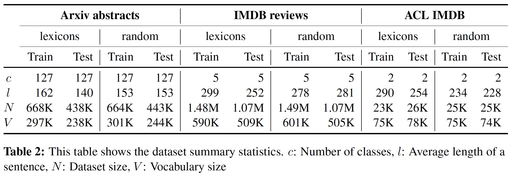
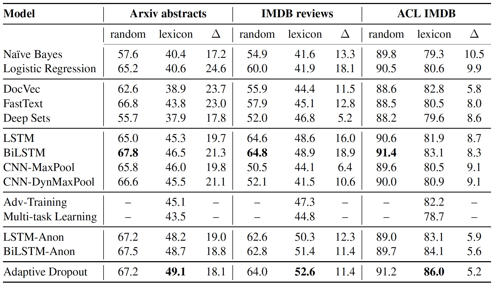
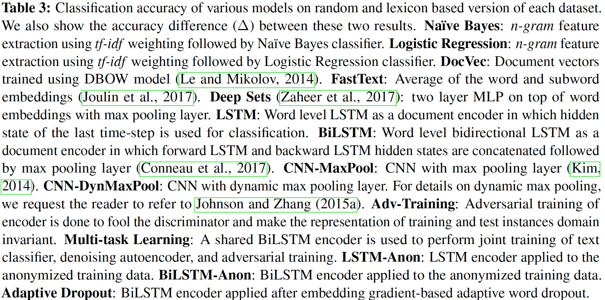
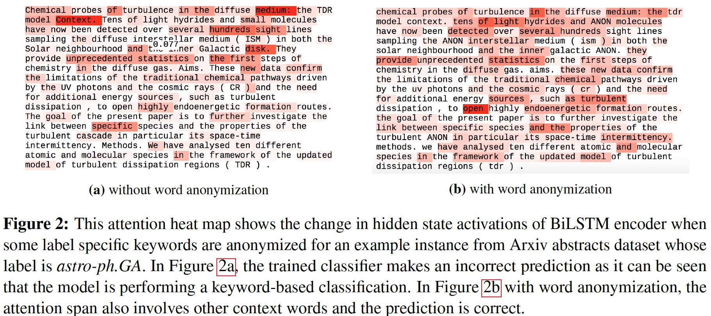

# 对于文本分类器工作的研究 

此篇文章是由卡内基梅隆大学的计算机科学学院在2018年发表于COLING上的文章

[原文链接](https://arxiv.org/abs/1801.06261)

[TOC]

## 摘要

基于组合性的原则，目前有很多大型神经网络模型用于文本分类，并且取得了很好的效果，但是作者想要探究这些模型是否真正的学习到了构成句子的语义含义，还是仅仅只是依据关键词来进行文档分类的。为了验证作者的猜想，作者精心的构建了这样的数据集：训练集和测试集分开，在字典上没有直接的重叠，但是整体的语言结构是相似的。作者研究了很多的文本分类器，发现他们在这样的数据集上都有很大程度上的下滑。最后，作者提出了一种正则化技术，用来抑制对关键词的关注。这样的正则化方法，即使是应用在简单的模型上也可以大大的提高分类的准确率

## 介绍

文本分类是NLP中的一个基本任务，并且有很多的应用，比如对于新闻标题的主题分类，对于评论的情感分析和邮件过滤等。但是由于我们需要在文档语义上编码句子之间的内在语义关系，所以文本分类在语言理解上仍然存在重大的挑战。尤其是在情感分类上，表现的尤为重要。

传统的文本分类是使用词袋模型表示一个文档，即使用词频作为特征，后接分类器比如朴素贝叶斯分类器或者支持向量机。这种方法的缺点：

1. 忽略了词序和语法结构
2. 数据稀疏性问题

为解决这些问题，通常通过去除噪声特征来执行特征选择以减少有效词汇量

接下来的文本分类方法是神经网络。主要是多层的CNN或者LSTM。其基于的原理是组合性原则，即较长表达（如句子和文档）的含义取决于其成分的含义。

然而，尽管想法是好的，但是这些最先进的文本分类方法却没有真正的实现这个机制。就像任何可以接收任何信号的判别方法一样，似乎这些技术很可能仍然学习并严重依赖于关键的词汇项或短语，并且只使用这些词汇来对文档进行分类，这可能不会推广到新文档。

为了验证我们的猜想，我们首先在第三节构建了数据集。在保证类平衡同时，使训练数据和测试数据没有关键词的重叠，而且使语言结构保持相同。这样的数据集是存在我们现实的生活中的，比如在科学文档领域，随着新现象，法律和定理的发现，就诞生了一个新的关键词。这个包含新关键词的文档仍然属于现存在的类，比如光学，生物化学或是离线数学。文本分类器应该能够正确地对给定文档进行分类，因为语言结构是保持不变的。

+ 在第五节中，作者研究了多个文本分类器在新的分割训练-测试集上的性能，并且将性能结果与此类数据集的常用随机训练-测试分割进行比较。作者发现存在很大的性能差异。

+ 作者进一步表明，即使使用随机嵌入替换关键词的简单的正则化技术也可以提高这这种分割训练-测试集上的性能

+ 作者在第4节中还提出了一种基于词嵌入梯度的新方法，可以进一步改进这个数据集的分割。

+ 作者还提供了两个基于随机分割和词典分割的大型文本分类数据集

+ 作者通过将上述问题建模为无监督域适应的情况来报告其他实验结果，其中训练域和测试域的数据分布不同[Domain-adversarial training of neural networks](https://arxiv.org/pdf/1505.07818v4.pdf)、 [Aspect-augmented adversarial networks for domain adaptation](https://arxiv.org/pdf/1701.00188.pdf)

  但是这种领域适应方法也没有产生比以上正则化技术更好的结果

## 背景和相关工作

### 神经网络方法

神经网络方法将这些单词的分布式表示作为输入，也称为词向量(word vectors)。这些词向量可以通过skip-gramh和Glove方法学习得到。这些向量的显著特征是可以在嵌入空间学习单词之间的语义相似性，即语义相似的单词距离更近。为了从这些词向量学习文档的特征，[Distributed representations of sentences and documents](https://arxiv.org/pdf/1405.4053.pdf)使用分布式的词袋方法，也叫做段落向量。[Bag of tricks for efficient text classification](https://arxiv.org/pdf/1607.01759.pdf)通过计算词向量和子词向量的平均值来训练线性分类器。

为了获取文本分类的句子级特征，[Convolutional neural networks for sentence classification](https://arxiv.org/pdf/1408.5882.pdf)在预训练的单词向量之上使用带有最大化池的浅层CNN。他们也观察到微调学习特定任务的向量可以提高分类准确率。类似的，[Semi-supervised sequence learning](https://arxiv.org/pdf/1511.01432.pdf)使用语言模型参数或者序列自动编码参数预训练的LSTM网络进行文本分类。[Effective use of word order for text categorization with convolutional neural networks.](https://arxiv.org/pdf/1412.1058.pdf)表明，当使用输入字的单热编码表示训练时，具有动态最大化池层的CNN能有效的使用词序信息。他们还通过半监督学习学习多视图区域嵌入，并将它们作为附加功能加入，以进一步提高模型的性能；类似地，他们还使用简化的LSTM模型执行半监督实验，该模型也将单词的单热编码作为输入。

### 域适应

在无监督的域适应中，来自训练数据的标记实例被视为源域，而来自测试数据的未标记实例被视为目标域。在此篇论文中假设两个域之间存在协方差偏移，即类标签的条件分布在两个域中保持相同，而实例的边际分布不同.为了解决协方差偏移的问题，尝试通过对编码器进行对抗训练以使文档表示域不变[Domain-adversarial training of neural networks](https://arxiv.org/pdf/1505.07818v4.pdf)

对于领域适应的另一个方法是多任务学习，假设通过并行学习相关任务，同时使用文档编码器的共享表示可以通过诱导适当的归纳偏差来改善泛化。

## 词典数据集构建

使用3个数据集：IMDB reviews, its standard subset, Arxiv abstracts。

每个数据集都被分成了两个版本：随机分割版和词典分割版

具体分割方法：

1. 识别重要标签特定词典：首先对于所有的文档获取tf-idf权重，five-gram的单词特征。然后用已经获得的特征向量作为输入，训练一个多项的朴素贝叶斯分类器用于预测整个数据集的类。通过训练贝叶斯分类器，可以获得特征权重。接下来，我们通过将所有特征值除以所有类中该特征的相应最小值来重新缩放特征权重。最后，为了鉴别词汇，我们选择每个类中最大权重的的top-k个特征。对于IMDB数据集，我们选择k的值为500，Arxiv abstracts为150

2. 创建词典-文档图：由于每一个标签特定词能出现在很多的文档中，一个文档中也会包含很多这样的词，为了使得训练和测试集中的词和文档不相交，使用图结构来表示词和文档。因此，为每一个类创建一个无向图，节点分别为词和文档。如果这样的词出现在文档中，就在图中两个相应的节点添加一条边。这是一个二分图，如图1a所示

   

   3. 分割图生成训练和测试集：首先计算词典-文档图的所有节点的度，然后找到最大度的节点，其中与他相连的所有文档作为训练集，其余的都为测试集，如图1b所示。若训练集和测试集的比率低于预定义的阈值，则我们通过逐渐选择较少的top-k特征（即较小的词典集）重复上述步骤。Arxiv abstracts和IMDB reviews的分割训练集和测试集的一些示例词典如表1所示

      

      需要强调的是，在创建了训练和测试集之后，大多数的单词在两个词版本中都有出现。

      ## 方法

      作者首先描述了提出的这个正则化方法所基于的简单的神经网络。

      这个网络是由一个嵌入层，单层的双向LSTM，一个池化层，一个用于分类的softmax线性层组成。首先将单词顺序输入到嵌入层，嵌入层将他们映射成为密集的向量。然后BiLSTM的前向LSTM和后向LSTM分别在前向和反向方向上处理这些字向量的输入序列。最后前向LSTM和后向LSTM的隐藏状态在每个时间步连接并传递到池化层，该池化层计算时间维度上的最大值以获得输入序列的表示。我们通过最小化交叉熵损失来训练模型

      然而作者在ACL IMDB随机分割和词典分割的数据集上训练了多种神经网络模型，观察到，在词汇分割的数据集上，网络很容易在1-2个时期内学习训练数据分布。随着训练和测试数据集之间的精确差距扩大，这些模型也会对词典分割过度拟合。作者猜想，发生这种情况的原因是在训练过程中，该模型能够记住训练集中出现的常见标签-特定关键字。在评估的过程中，由于在训练过程中不包含重叠的关键词，模型就无法在测试集中发现此关键词，因此相比与随机分割的数据集版本，这个性能就下降的非常厉害。因此基于这个观察，作者提出了两种方法，试图通过在关键词中引入更多的随机性来阻止神经网络记忆关键词中的词序结构。

      ### 关键词匿名化

      为了防止模型记忆关键字特定规则并因此学习退化表示，作者在训练数据分割中引入了更多随机性。第一步使用词袋作为特征训练的有监督分类器来识别具有高分的一些关键词。第一步类似于数据构建的第一步，主要的区别在于现在我们只在训练集上操作，因为在训练阶段测试集假设是不知道的。在第二步中，在这些共同出现的关键词短语中随机选择一个单个的词，使用占位符'ANON'替换掉。在第三步中，我们在模型训练期间为占位符字'ANON'的每次出现分配一个随机字嵌入。这些修改的词嵌入作为神经网络编码器的输入。通过这种方式，我们通过在数据中引入某种形式的随机噪声来破坏关键字中存在的信息。这是正则化模型训练的一种方式。我们后来表明，这种正规化迫使网络学习上下文感知的文本表示，从而显着提高分类准确性。 由于这种方法的有效性，我们现在提出端到端版本作为下一种方法

      ### 自适应词丢失

      该方法基于嵌入层的梯度，该梯度在每个优化步骤中计算。这种方法是基于关键词具有更高的嵌入梯度范数。首先在反向传播过程中，计算词嵌入梯度。第二步对于每个单词，我们保持该梯度的L2范数的运行平均值。该平均值是相对于完成的优化步骤的数量计算的。

      

      在第三步中，计算每个单词的丢失概率。

      

      以上的超参数中，t是超参数(t的典型取值是10-3,10-4)，作者在词嵌入层之前，对单词应用了丢失概率Pd(w)；在词嵌入层之后，应用了变种的丢失概率[A theoretically grounded application of dropout in recurrent neural networks](https://arxiv.org/pdf/1512.05287.pdf).

      ## 实验

      

      作者提出实证研究，以确定（i）许多文本分类器只是识别关键词，因此在特制分割数据集上表现不佳（ii）简单的正则化技术可以抑制对关键词典的关注，显着提高性能。

      ### 数据集描述

      作者在二元情感分类数据集上进行评估，并且收集了两个大规模的文本数据集。

      - ACL IMDB:这是一个对于情感分类流行的IMDB电影评论基准数据集 [Learning word vectors for sentiment analysis](https://dl.acm.org/citation.cfm?id=2002491)用于粗粒度的情感分析即只有积极和消极两大类该数据集的原始随机拆分版本包含相同数量的高度正面和高度负面的评论。为了构建基于词的版本，我们将我们的方法应用于该数据集的组合训练和测试分割。

      - IMDB reviews：这是IMDB电影评论数据集的大版本，他的任务是做细粒度的情感分析。我们从IMDB网站收集了超过250万条评论，并根据10条评级将其分为五类即most-negative, negative, neutral, positive, and most-positive

      - Arxiv abstracts：他的任务是做多分类的主题分类。我们通过从“arxiv.org”收集超过100万份科学论文摘要来构建这个数据集，每篇文章都有一个主要分类，例如 cs.AI, stat.ML.我们选择了至少有500篇论文的主要类别。在Arxiv摘要和IMDB评论数据集中，我们将测试集中的实例数与训练集的实例数保持为0.6。

        作者将所有文本转换成了小写，并且使用Penn Treebank style tokenization预处理数据。表2提供了词拆分和随机拆分训练测试数据集的总体概要。

        

        ### 实验设置

        对于简单的基线比较，作者使用词袋作为输入特征表示的方法进行实验。具体来说，我们为每个文档计算tf-idf加权n-gram特征，以训练多项式NaïveBayes和Logistic回归分类器。对于神经网络模型，除非另有说明，否则我们对所有数据集都有基于Pytorch框架（Paszke等，2017 Automatic differentiation in pytorch）的通用实验设置。由于计算限制，我们没有对所考虑的方法执行广泛的超参数调整。我们选择最常见的80K词进行模型训练。我们使用300维预训练嵌入初始化所有模型的嵌入层参数。这些嵌入在组合训练和测试集上使用skip-gram方法进行训练(作者用了word2vec工具)。在这些向量中不存在的单词的嵌入被均匀地初始化。LSTM和BiLSTM的隐藏状态分别1024和512维度。对于CNN模型的训练，作者设置的相同于[Yoon Kim. 2014. Convolutional neural networks for sentence classification.](https://arxiv.org/pdf/1408.5882.pdf)作者使用批量大小为150的小批量随机梯度下降进行模型训练，使用Adam Optimizer优化器[Diederik P. Kingma and Jimmy Ba. 2014. Adam: A method for stochastic optimization](https://arxiv.org/pdf/1412.6980.pdf)为了训练LSTM模型，我们在IMDB数据集上执行250次步进的反向传播，在Arxiv摘要数据集上执行150次步进。对于模型正则化，我们将概率为0.5的丢失率应用于LSTM的输入和输出上。为了防止梯度爆炸问题，我们通过约束梯度的范数小于5来执行梯度限幅。

        ### 实验结果

        通过表3可以看出所有的模型在随机拆分和词拆分版本的数据集的结果上都有很大的性能下滑。

        

        

        #### 词袋模型

        简单的生成分类器Naïve Bayes在Arxiv abstracts and IMDB reviews数据集上表现不好，但是在ACL IMDB表现还可以。逻辑回归这种辨别分类器表现性能在所有随机拆分数据集上都比Naïve Bayes好。但是在词拆分数据集上的表现性能上都没有神经网络的方法好。这些得分低可以解释为输入特征的条件独立性假设造成的。在训练步骤中，基于词袋的模型会为类特定的关键词设置很高的权重。

        #### 基于简单词嵌入的方法

        作者使用DBOW模型的标准训练设置训练300维文档向量，使用推荐的训练设置对于FastText模型。在IMDB词版本数据集上都提高了结果。尽管DBOW和FastText模型都没有严格的利用句子之间的词序信息，但是他们利用了嵌入空间的语义属性。因为文档向量也和词向量在相同的几何空间里被学习。

        #### 卷积网络和循环网络

        前文已经提到过，不管是CNN还是LSTM都能学习有效的文本表示，所以他们表现出了很好的效果。而且模型越复杂比如双向LSTM，性能就越有提高。但是尽管提高了分类性能的准确率，但是相比于随机拆分还是有很大的性能下滑。为了缩小这种性能差距，需要能够学习更强大的基于上下文的表示的方法，以便可以改进包含新的看不见的关键短语的文档的性能。

        #### 领域适应性方法

        对于词典拆分，可以认为训练和测试数据分布是不同的，因此将其建模为无监督域自适应的实例。作者评估了这种域适应的两种不同方法：对抗性训练和多任务学习。

        为了解决词典数据集拆分中的词汇/协方差转换，作者对比训练BiLSTM模型，目的是得到的文档表示使其对文本分类任务具有辨别力，同时对训练/测试域分类不加区别。为了执行这种领域不变的对抗训练，我们介绍了一个鉴别器模型，它由三个前馈层组成。为了学习模型参数，我们遵循[Ganin et al.2016](https://arxiv.org/pdf/1505.07818v4.pdf)训练方法。但不是梯度反转，我们提供领域的互换标签来欺骗鉴别器。 从结果中，我们观察到编码器的对抗训练会损害词典数据集的性能。

        在多任务学习中，联合训练的各种任务是文本分类，去噪自动编码器和对抗训练。在所有的这些任务中，分享嵌入层和双向LSTM编码层。

        作者没有在随机拆分的数据集上试验这些领域自适应方法，因为假设它在训练和测试集中包含相同的词典分布。此外，由于最初的结果在词典数据集上并不乐观，我们没有尝试更复杂的方法。

        ### 我们的方法

        应用于随机嵌入替换的匿名训练数据的BiLSTM编码器在Arxiv摘要数据集上的性能提高约2％，在IMDB评论数据集上的性能提高2.5％，并且ACL IMDB词典拆分数据集的性能提高约1％。这表明在基于词典拆分的情况下，使用随机嵌入替换的关键字匿名化可以是模型正则化的良好策略。从定性的角度来看，我们在图2中显示了数据匿名后BiLSTM编码器隐藏状态激活的变化

        

        ## 结论

        最近，多层神经网络模型因其比传统的基于词袋的方法更好的性能而在文本分类任务中获得了广泛的普及。人们普遍认为，这是因为神经网络可以有效地利用文档中存在的词序结构。但是，潜在的缺点是，由于所有神经网络方法都是鉴别器，因此它们倾向于识别训练数据中的关键信号，这些关键信号可能不会出现在测试数据中。在这项工作中，作者调查这些神经网络模型是否真正学会组成句子的含义或仅使用关键词来判别。

        为了测试不同最先进的文本分类器的泛化能力，我们构建了这样的数据集，其中训练和测试分开并且没有词的直接重叠。我们对流行文本分类器的实验表明，这些数据集的随机拆分和词典拆分之间的测试分类准确度大幅下降。我们表明，简单的正则化技术，如关键字匿名化，可以大大提高文本分类器的性能。我们还观察到基于嵌入层梯度的自适应字丢失方法可以进一步提高准确度，从而减小两个数据集分裂之间的差距。

        

        

      

      

   