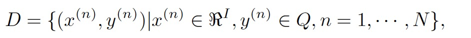
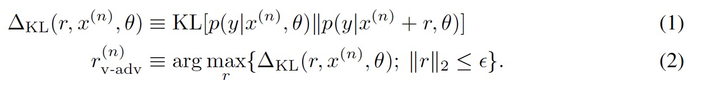
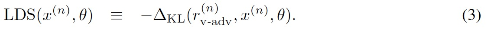
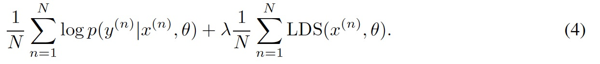

# DISTRIBUTIONAL SMOOTHING WITH VIRTUAL ADVERSARIAL TRAINING

分布式平滑与虚拟对抗训练。作者Takeru Miyato于2016年发表于ICLR

## 摘要

作者提出了局部分布平滑(LDS),是统计模型平滑度的新概念，可用作正则化项，以促进模型分布的平滑性。作者将基于LDS的正则化命名为虚拟对抗训练（VAT）。模型在输入数据点处的LDS定义为基于KL散度的模型分布对数据点周围局部扰动的鲁棒性。VAT类似于对抗训练，但与之不同的是，虚拟对抗训练在不使用标签信息的情况下，仅从模型分布中确定对抗性方向，适用于半监督学习。VAT的计算成本相对较低。对于神经网络，LDS的近似梯度可以通过不超过三对的正向和反向传播来计算。作者将技术应用于MNIST数据集的监督和半监督学习时，它比现有的基于高级生成模型的训练方法有更好的表现。还将他们的方法应用于SVHN和NORB，并证实了作者提出的的方法优于目前应用于这些数据集的半监督方法。

## 1介绍

过度拟合是分类和回归函数监督训练中的一个严重问题。当训练样本数量有限时，由训练样本的经验分布计算出的训练误差必然与测试误差不同，测试误差是对数似然对真实潜在概率测度的期望。

针对过度拟合的一种常见对策是在目标函数中添加正则化项，正则化项的引入使得目标函数的最优参数对似然项的依赖性减小。在贝叶斯框架中，正则化项对应于参数的先验分布的对数，其定义了模型分布的偏好。当然，没有普遍良好的模型分布，应根据我们解决的问题选择良好的模型分布。尽管如此，我们的经验常常要求良好模型的输出在输入方面应该是平滑的。例如，自然界中出现的图像和时间序列相对于空间和时间趋于平滑。因此，我们将发明一种称为局部分布平滑度（LDS）的新型正则化项，它相对于每个输入数据点周围的输入奖励模型分布的平滑性。作者将LDS定义为模型分布p（y|x）相对于x的扰动的灵敏度的负值，在KL散度的意义上测量。因此，基于该正则化项的目标函数是数据集的对数似然性，其增加了在数据集中的每个输入数据点处计算的LDS的总和。因为LDS正是测量模型分布本身的局部平滑度，所以正则化项是参数化不变的。无论参数化如何，用LDS正则化训练的最优模型分布是唯一的。

我们的工作和对抗训练相似[Explaining and harnessing adversarial examples](https://arxiv.org/pdf/1412.6572.pdf)在训练的每一步，（Goodfellow等）对观测到的每对输入x及其标签y，都确定了分类器对输入x的标签分配最敏感的扰动方向，然后惩罚模型对对抗方向扰动的敏感性。另一方面，我们定义的LDS没有标签信息。因此，利用对抗性训练的语言，LDS在每一点都在测量模型对局部和“虚拟”对抗方向扰动的鲁棒性。由于LDS不需要标签信息，因此VAT也适用于半监督学习，这和对抗训练是不同的。

此外，利用LDS的二阶泰勒展开和功率方法的应用，我们使得有效地近似LDS的梯度成为可能。 可以使用不超过三对前向和后向传播来计算LDS的近似梯度。

作者总结了他们方法的优势：

+ 既可应用于监督训练，也可应用于半监督训练
+ 仅有两个超参数
+ 参数化不变公式。 在模型的回归化下，该方法的性能是不变的
+ 计算成本低。 特别是对于神经网络，LDS的近似梯度可以用不超过三对前向和后向传播来计算

当我们将VAT应用于MNIST数据集的置换不变任务的监督和半监督学习时，我们的方法优于除了使用高度的现有技术方法（Rasmus等，2015）之外的所有基于先进生成模型的方法。 我们还将我们的方法应用于SVHN和NORB数据集的置换不变任务的半监督学习，并证实了我们的方法优于应用于这些数据集的当前现有技术半监督方法。

## 2模型

### 2.1局部分布平滑的形式化

定义：固定参数，输入空间R,输出空间Q，训练样例为：

考虑到利用D训练模型分布p(y|x)问题。使用KL[p||q]表明分布p和q之间的KL散度，其中超参数大于0，定义如下:

r为虚拟对抗扰动。我们在x（n）处定义模型分布的局部分布平滑（LDS）：

注意到，r是模型分布p(y|x)在KL散度上最敏感的方向。在某种程度上，这是模型分布相对于输入的梯度的KL发散模拟。x在这个方向上的扰动以最可怕的方式破坏了x（n）处的p（y|x）的局部平滑性。公式（1）在x处的值越小，p(y|x)在x越平滑。我们的目标是在所有观察到的输入附近改善模型的平滑度。 基于LDS制定这一目标，我们获得了以下目标函数：

我们称基于公式（4）的训练为虚拟对抗训练（VAT）。

### 2.2 LDS及其衍生物的有效评价

一旦计算出r，那么LDS的评估就是模型分布之间的KL离散。当p（y|x）可以用众所周知的指数族近似时，这种计算是直截了当的。例如，可以对许多NN情况使用高斯近似。 在下文中，我们讨论了r的有效计算，因为他没有明显的近似。

#### 

